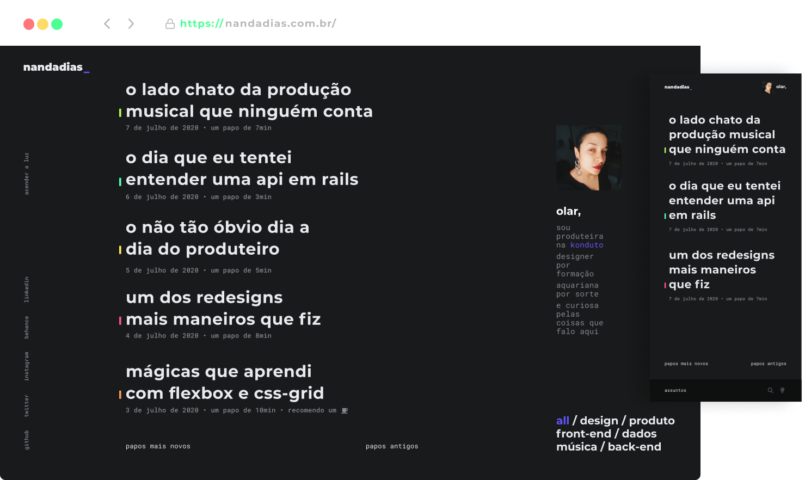

<p align="center">
  <a href="https://www.nandadias.com.br/">
    
  </a>
</p>
<h1 align="center">
  My personal blog
</h1>

<div align="center">


[](https://github.com/fernandadias/nandadias-blog/issues)

</div>


Project made in React with Gatsby, GraphQL and Styled Components. Algolia Instant Search for search feature, NetlifyCMS for content updates and hosted in Netlify. [Take a look](http://www.nandadias.com.br/)


## 🖍️ design

<p align="center">
  
</p>

I made all layouts on **Figma** first. You can see [can see all assets here](https://www.figma.com/file/KSTHCMkK3jNsn5V9UpvPpS/Meu-Blog?node-id=0%3A1).
The idea is a "flat place" where I could put different content without being confused. So a minimalist and straightforward layout.

For category colors and theme mode I used **styled components props** (that's awesome!) and **css vars**. So, if you want to update something, take a look at the global styles and check the passed props for the components.

```css
/* example */
  {
    --musicColor: #B4FE56;
    --designColor: #FE5688;
    --productColor: #FEED56;
    --frontColor: #FE9C56;
    --dataColor: #56EAFE;
    --backColor: #56FEB7;
  }
```

## 🎓 Technologies

I did this project to study and I didn't know most of the technologies I used. So, if you want to know more, take a look:

- [Gatsby](https://www.gatsbyjs.org/)
- [GraphQL](https://graphql.org/)
- [Styled Components](https://www.styled-components.com/)
- [Algolia Instant Search](https://www.algolia.com/products/instantsearch/)
- [NetlifyCMS](https://www.netlifycms.org/)


## 🧐 What's inside?

A quick look at the top-level important files and directories.

    .
    ├── posts
    ├── src
    ├──── components
    ├──── images
    ├──── pages
    ├──── styles
    ├──── templates
    ├──── utils
    └── gatsby-node.js

1.  **`/posts`**: This directory contains all of markdown for posts. They was generate from NetlifyCMS.

2.  **`/src`**: This directory contains all of the code related to what you will see on the front-end.
    - `components`:  All styled components. They were structured following a pattern of `index.js` for the react code and importing (` import * as S from './styles'`) the styles of `styles.js`, a file that is in the same folder.
    - `images`: All static images used in project (in the end was just my avatar photo and 404 gif).
    - `pages`: Here have templates for static pages.
    - `styles`: Global styles for reset, fonts and css vars.
    - `templates`: This directory contains templates for pages that batsby build will generate (for feed and posts page).
    - `utils`: Graphql query for post content in Algolia.

3.  **`gatsby-node.js`**: This file is where I put all back-end configs, using [Gatsby Node APIs](https://www.gatsbyjs.org/docs/node-apis/).


## 💻 Usage

Use a package manager of your choice (npm, yarn, etc.) in order to install all dependencies

```bash
npm install
```

```bash
yarn install
```

**Running**
In order to run this project you need to execute `gatsby develop` to build develop mode off gatsby and `gatsby build` to build in production mode.

## Contributing

Pull requests are always welcome 😃.
